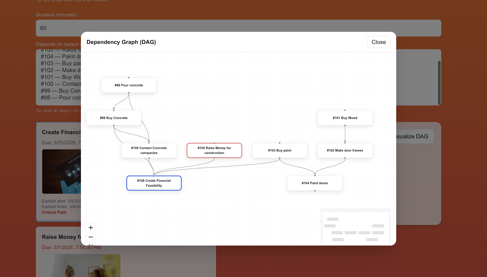
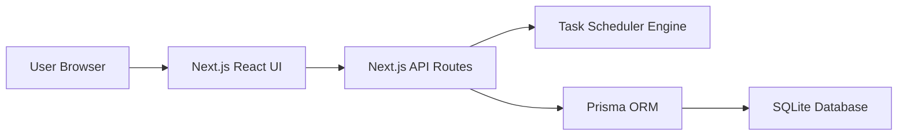

## XXXXX Technical Assessment

This is a technical assessment as part of the interview process for XXXXXX.

> [!IMPORTANT]  
> You will need a Pexels API key to complete the technical assessment portion of the application. You can sign up for a free API key at https://www.pexels.com/api/  

To begin, clone this repository to your local machine.

## Development

This is a [NextJS](https://nextjs.org) app, with a SQLite based backend, intended to be run with the LTS version of Node.

To run the development server:

```bash
npm i
npm run dev
```

## Task:

Modify the code to add support for due dates, image previews, and task dependencies.

### Part 1: Due Dates 

When a new task is created, users should be able to set a due date.

When showing the task list is shown, it must display the due date, and if the date is past the current time, the due date should be in red.

### Part 2: Image Generation 

When a todo is created, search for and display a relevant image to visualize the task to be done. 

To do this, make a request to the [Pexels API](https://www.pexels.com/api/) using the task description as a search query. Display the returned image to the user within the appropriate todo item. While the image is being loaded, indicate a loading state.

You will need to sign up for a free Pexels API key to make the fetch request. 

### Part 3: Task Dependencies

Implement a task dependency system that allows tasks to depend on other tasks. The system must:

1. Allow tasks to have multiple dependencies
2. Prevent circular dependencies
3. Show the critical path
4. Calculate the earliest possible start date for each task based on its dependencies
5. Visualize the dependency graph

## Submission:

1. Add a new "Solution" section to this README with a description and screenshot or recording of your solution. 
2. Push your changes to a public GitHub repository.
3. Submit a link to your repository in the application form.

Thanks for your time and effort. We'll be in touch soon!

## ########################################################
## SOLUTION - MAMOON I KHALID: ############################
## ########################################################
This project implements a task planning system that supports dependencies, scheduling, and visualization of dependency graphs.
## Screenshots

### Task List UI


### Dependency Graph (DAG Visualization)



## Architecture



### Key Components

**Frontend**
- React + Next.js UI
- Task management interface
- DAG visualization using React Flow

**Backend**
- Next.js API routes
- Prisma ORM
- SQLite persistence layer

**Scheduler**
- Computes earliest start/finish
- Calculates slack time
- Determines critical path

## Features

- Create and delete tasks
- Assign task durations
- Define dependencies between tasks
- Automatic scheduling calculation
- Critical Path detection
- Interactive DAG (Directed Acyclic Graph) visualization
- Image preview for tasks
- Responsive UI built with React + Tailwind

---

## Tech Stack

Frontend
- Next.js
- React
- TailwindCSS

Backend
- Next.js API routes
- Prisma ORM
- SQLite database

Visualization
- React Flow
- Dagre layout algorithm

---

## Scheduling Logic

Each task includes:

- durationMinutes
- dependencies
- earliestStart
- earliestFinish
- slackMinutes
- isCritical

The scheduler computes:

1. Topological ordering of tasks
2. Forward pass (earliest start/finish)
3. Backward pass (slack calculation)
4. Critical path detection

---

## Implementation Overview

The solution extends the provided Next.js application to support due dates, image previews, and task dependencies with scheduling logic.

Key additions include:

- Prisma schema extensions for task dependencies and scheduling fields
- A scheduling engine that computes earliest start/finish times and identifies the critical path
- Integration with the Pexels API to dynamically generate task images
- A DAG visualization built using React Flow and Dagre
- UI improvements to support dependency selection and task inspection

## Design Decisions

### DAG-based Scheduling

Task dependencies form a Directed Acyclic Graph (DAG).  
A topological ordering is used to compute earliest start and finish times.

### Critical Path Calculation

A forward pass determines earliest start/finish times, while a backward pass computes slack time and identifies the critical path.

### Graph Visualization

The dependency graph is rendered using React Flow, with Dagre used to compute a readable layout for the DAG.


## Running the Project

Install dependencies:

```bash
npm install

Run the dev server:
npm run dev

Open:
http://localhost:3000
```

## DAG Visualization

Click "Visualize DAG" to open the dependency graph.
Red nodes = Critical Path
Blue node = Selected task
Edges represent dependency relationships

## Future Improvements

If additional time were available:

- Display reverse dependencies (dependents)
- Highlight dependency chains in the graph
- Slack time visualization in the UI
- Drag-and-drop graph editing
- Postgres database for production persistence

## Author
Mamoon Khalid
